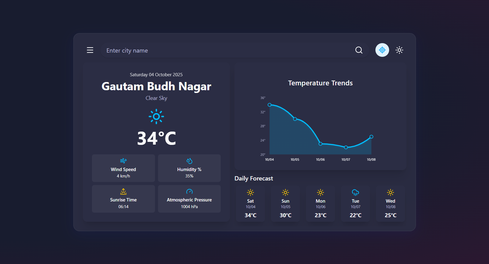
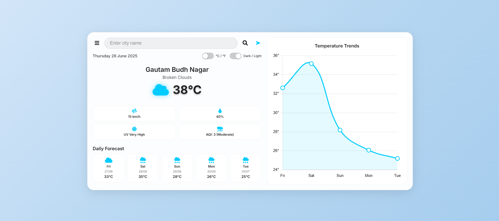

# 🌦️ Mausam360 - Weather Dashboard Web App

A sleek, interactive weather dashboard providing real-time weather updates, temperature trends, and daily forecasts. Enjoy a modern UI, responsive charts, and theme switching between dark and light modes.

---

## 📋 Table of Contents

- [Features](#-features)
- [Dashboard Overview](#-dashboard-overview)
- [Technical Details](#-technical-details)
- [Run Instructions](#-run-instructions)
- [Technologies Used](#️-technologies-used)
- [Author](#-author)
- [Screenshots](#-screenshots)

---

## 🌟 Features

- **Live Weather Data**
  - Current weather conditions for any city
  - Temperature, humidity, wind, sunrise, and pressure details
  - Weather icons for clear, cloudy, rainy, and more

- **Temperature Trends**
  - Interactive chart showing temperature changes over days
  - Responsive and fills the entire trends box

- **Daily Forecast**
  - 5-day forecast with icons and temperature
  - Easy-to-read layout

- **Modern UI**
  - Glassmorphism cards and dashboard
  - Vibrant color palette and glowing effects
  - Accessible, professional design

- **Theme Support**
  - Toggle between dark and light modes
  - Smooth transitions and consistent colors

---

## 🖥️ Dashboard Overview

- Search for any city to view its weather
- See current conditions and daily forecast
- Analyze temperature trends in a responsive chart
- All data updates in real-time

---

## 🔧 Technical Details

- **Responsive Design**
  - Works on all screen sizes
  - Touch-friendly controls
  - Fluid chart and card layouts

- **Performance Optimized**
  - Efficient React state management
  - Fast updates and smooth transitions

---

## 💻 Run Instructions

1. Clone the repository:
   ```bash
   git clone https://github.com/kartikkkandpal/Mausam360.git
   cd Mausam360
   ```

2. Install dependencies:
   ```bash
   npm install
   ```

3. **Set up your environment variables:**
   - Create a `.env` file in the root directory.
   - Add your OpenWeather API key:
     ```
     VITE_WEATHER_API_KEY=your_openweather_api_key_here
     ```

4. Start the app:
   ```bash
   npm run dev
   ```

5. Open Link in Your Browser:
   ```
   http://localhost:5173
   ```

---

## 🛠️ Technologies Used

- **Frontend**
  - React
  - Tailwind CSS
  - Modern CSS (Glassmorphism, gradients, transitions)
  - Open Weather API
  - Vite

---

## 👤 Author

- [Kartik Kandpal](https://github.com/kartikkkandpal)

## 🖼️ Screenshots




---

Get real-time weather updates and enjoy a beautiful, modern weather dashboard experience!